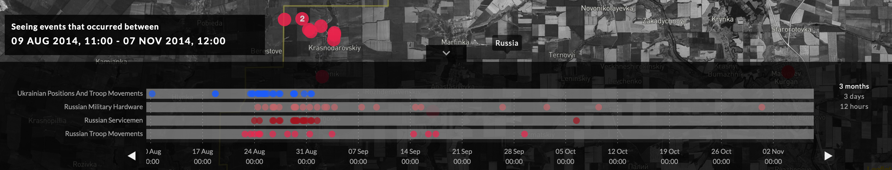
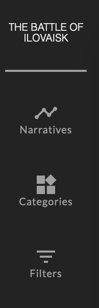

# User Interface Styling


## The Time Map

### Min and Max Map Zoom

        minZoom: 5,
        maxZoom: 15,

Lower limit
Upper limit
startZoom

### maxBounds

### Anchor

the centre of the map

```
map: {
        minZoom: 5,
        maxZoom: 15,
        startZoom: 7,
        maxBounds: [-41.244, 174.621],
        bounds: null,
        maxBounds: [[180, -180], [-180, 180]]
         anchor: [-41.2442852, 174.6217707]
   },
```

## categories

colours

CSS hex values, etc.)

   ```
    ui: {
      style: {
        categories:
        {
          'Legislation': '#939393',
          'Child Welfare': 'red',
          'Psychiatric Care': '#545454',
          'Mass Incarceration': '#F5F5F5'
        },
        }
      }
    }
  ```


## Narratives

      "Narratives compose events to reveal logical threads that emerge from them. Transition to narrative mode by selecting a narrative from the top left dashboard icon."
        ],
        "notation": "Combinations of colours indicate multiple events in a single location.",
        "arrows": "Arrows indicate physical movement between events."
    


   ```
    ui: {
      style: {
        narratives: {
          default: {
            stroke: 'none'
          }
        },
        shapes: {
          default: {
            stroke: 'blue',
            strokeWidth: 3,
            opacity: 0.9
          }
        }
      }
    }
  ```

# Timeline




# zoomLevels


## Label

text

## Duration

Minutes 

1 year 525600

Range

Range Limits

```
   timeline: {
        zoomLevels: [
          { label: 'All Years', duration: 9.461e+7 },
          { label: '50 Years', duration: 2.628e+7 },
          { label: '5 Years', duration: 2.628e+6 },
          { label: '1 Year', duration: 525600 }
        ],
        range: ['1840-12-01T12:00:00', '2020-12-01T12:00:00'],
        rangeLimits: ['1840-12-01T12:00:00', '2020-12-01T12:00:00']
      },
```


//state.ui.style.selectedEvents
  //  selected: state.app.selected,
  //     language: state.app.language,
  //     timeline: state.app.timeline,
  //     narrative: state.app.narrative
//   this.props.event.type === 'Structure'

//      bounds: null,
  //    maxBounds: [[180, -180], [-180, 180]]
            //timeline.dimensions

  


